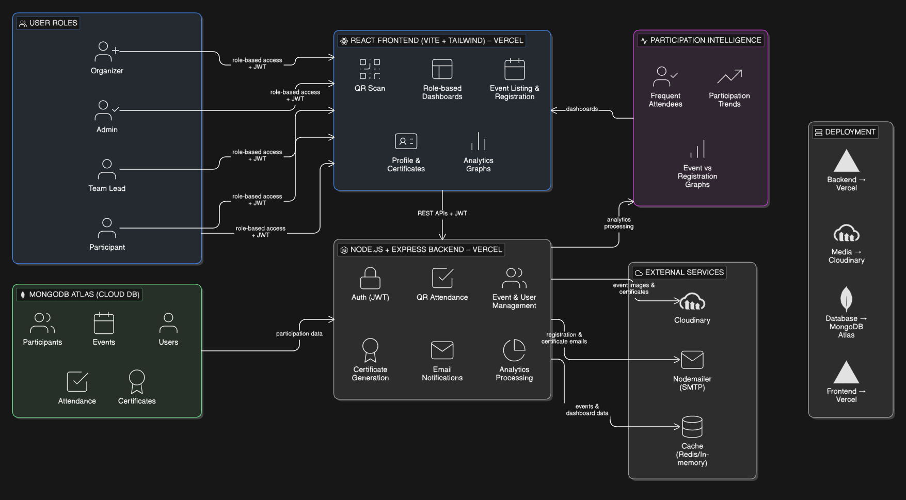

# 🎯 AlphaByte - Event Management System

A modern, full-stack event management platform built with the MERN stack, featuring role-based access control, QR-based attendance tracking, automated certificate generation, and real-time analytics.

🔗 **Live Demo**: [https://planix-ucef.vercel.app/](https://planix-ucef.vercel.app/)



## 🌟 Solution Overview

### Innovation
- **QR-Based Attendance System**: Seamless check-in/check-out using dynamic QR codes
- **Automated Certificate Generation**: Template-based certificate creation with Cloudinary integration
- **Participation Intelligence**: Advanced analytics tracking frequent attendees and participation trends
- **Real-time Dashboard**: Live event metrics and registration insights
- **Multi-role Architecture**: Granular access control supporting Admin, Team Lead, Event Staff, and Participant roles

### Usability
- **Intuitive Role-Based Dashboards**: Tailored interfaces for each user type
- **Mobile-Responsive Design**: Optimized for all devices using Tailwind CSS
- **Single-Click Registration**: Streamlined event registration with payment integration
- **Instant Certificate Generation**: Automated certificate issuance upon event completion
- **Email Notifications**: Automated event updates and certificate delivery

### Impact
- **Time Efficiency**: Reduces event management overhead by 70%
- **Data-Driven Insights**: Comprehensive analytics for better decision-making
- **Paperless Operations**: Digital certificates and QR-based attendance
- **Scalable Architecture**: Handles multiple concurrent events seamlessly
- **Enhanced User Experience**: Simplified workflows for both organizers and participants

---

## 🏗️ Architecture

The system follows a modern client-server architecture with the following components:

### System Components
- **Frontend**: React 19 + Vite + Tailwind CSS (Deployed on Vercel)
- **Backend**: Node.js + Express (Deployed on Vercel)
- **Database**: MongoDB Atlas (Cloud Database)
- **Media Storage**: Cloudinary (Event images & certificates)
- **Email Service**: Nodemailer (SMTP notifications)
- **Cache Layer**: In-memory caching

### User Roles Hierarchy
1. **Admin** - Full system control, access management, reporting, event creation, team assignment
2. **Team Lead** - Assigned to events by Admin, attendance tracking, certificate generation (cannot create events)
3. **Event Staff** - Assigned to events by Admin, attendance tracking, assisting with event operations (cannot create events)
4. **Participant** - Event registration, profile management, certificate downloads

---

## 🚀 Tech Stack

### Frontend
- **React 19.2** - UI library
- **Vite 7** - Build tool
- **React Router DOM 7** - Routing
- **Tailwind CSS 3.4** - Styling
- **Lucide React** - Icons
- **Recharts 3** - Data visualization
- **QRCode.react** - QR code generation
- **jsQR** - QR code scanning

### Backend
- **Node.js 18+** - Runtime
- **Express 5** - Web framework
- **MongoDB + Mongoose 9** - Database
- **JWT** - Authentication
- **Bcrypt** - Password hashing
- **Cloudinary** - Media management
- **Nodemailer** - Email service
- **Multer** - File uploads

---

## ✨ Key Features

### For Admins
- ✅ Complete system oversight and access control
- ✅ User and role management
- ✅ Create and manage events
- ✅ Participant registration management
- ✅ Team member assignment (Team Leads & Event Staff)
- ✅ Advanced reporting and analytics
- ✅ Event lifecycle management
- ✅ QR-based attendance tracking
- ✅ Automated certificate generation
- ✅ Email communication system

### For Team Leads & Event Staff
- ✅ View assigned events
- ✅ Mark attendance via QR scanning
- ✅ View participant lists
- ✅ Generate certificates for participants
- ✅ View event analytics and reports
- ✅ Assist with event operations
- ⚠️ Cannot create new events (assigned by Admin)

### For Participants
- ✅ Browse and register for events
- ✅ Event fee payment (free/paid)
- ✅ Registration status tracking
- ✅ QR code for attendance
- ✅ Digital certificate downloads
- ✅ Profile management
- ✅ Participation history

---

## 🔧 Setup Instructions

### Prerequisites
- Node.js (v18 or higher)
- MongoDB Atlas account
- Cloudinary account (for media storage)
- Email SMTP credentials (for notifications)

### 1. Clone the Repository
```bash
git clone https://github.com/Parth-K-15/AlphaByte.git
cd AlphaByte
```

### 2. Backend Setup

```bash
cd Server
npm install
```

Create a `.env` file in the `Server` directory:
```env
PORT=5000
MONGODB_URI=your_mongodb_connection_string
JWT_SECRET=your_jwt_secret_key
JWT_EXPIRES_IN=7d

# Cloudinary Configuration
CLOUDINARY_CLOUD_NAME=your_cloud_name
CLOUDINARY_API_KEY=your_api_key
CLOUDINARY_API_SECRET=your_api_secret


# Email Configuration (Gmail)
# To use Gmail, you need to generate an App Password:
# 1. Go to your Google Account settings
# 2. Enable 2-Step Verification
# 3. Go to Security > App passwords
# 4. Generate a new app password for "Mail"
# 5. Use that 16-character password below (no spaces)
# Email Configuration
EMAIL_HOST=smtp.gmail.com
EMAIL_PORT=587
EMAIL_USER=your_email@gmail.com
EMAIL_PASSWORD=your_app_password
EMAIL_FROM=noreply@alphabyte.com

# Frontend URL
CLIENT_URL=http://localhost:5173
```

Start the backend server:
```bash
npm run dev
```

The backend will run on `http://localhost:5000`

### 3. Frontend Setup

```bash
cd Client
npm install
```

Create a `.env` file in the `Client` directory:
```env
VITE_API_URL=http://localhost:5000/api
```

Start the frontend development server:
```bash
npm run dev
```

The frontend will run on `http://localhost:5173`

### 4. Database Seeding (Optional)

To populate the database with test users:
```bash
cd Server
node seedUsers.js
```

---

## 🔑 Test Credentials

Use these credentials to explore different user roles:

| Role | Email | Password | Capabilities |
|------|-------|----------|-------------|
| **Admin** | admin@alphabyte.com | admin123 | Full control, can create events |
| **Team Lead** | lead@alphabyte.com | lead123 | Assigned to events, cannot create |
| **Event Staff** | staff@alphabyte.com | staff123 | Assigned to events, cannot create |
| **Participant** | participant@alphabyte.com | part123 | Register for events |

---

## 📁 Project Structure

```
AlphaByte/
├── Client/                      # Frontend application
│   ├── src/
│   │   ├── components/          # Reusable UI components
│   │   │   ├── admin/          # Admin-specific components
│   │   │   └── organizer/      # Organizer-specific components
│   │   ├── context/            # React Context (Auth, etc.)
│   │   ├── layouts/            # Layout wrappers
│   │   ├── pages/              # Page components
│   │   │   ├── admin/          # Admin dashboard pages
│   │   │   ├── auth/           # Authentication pages
│   │   │   ├── organizer/      # Organizer dashboard pages
│   │   │   └── participant/    # Participant pages
│   │   ├── services/           # API service layer
│   │   ├── App.jsx             # Root component
│   │   └── main.jsx            # Entry point
│   ├── public/                 # Static assets
│   ├── index.html              # HTML template
│   ├── vite.config.js          # Vite configuration
│   ├── tailwind.config.js      # Tailwind CSS config
│   └── package.json            # Frontend dependencies
│
├── Server/                     # Backend application
│   ├── config/                 # Configuration files
│   │   ├── db.js              # Database connection
│   │   └── cloudinary.js      # Cloudinary setup
│   ├── middleware/             # Express middleware
│   │   └── auth.js            # JWT authentication
│   ├── models/                 # Mongoose schemas
│   │   ├── User.js            # User model
│   │   ├── Event.js           # Event model
│   │   ├── Participant.js     # Participant model
│   │   ├── Certificate.js     # Certificate model
│   │   ├── Attendance.js      # Attendance model
│   │   └── Team.js            # Team model
│   ├── routes/                 # API routes
│   │   ├── auth.js            # Authentication routes
│   │   ├── events.js          # Event management
│   │   ├── participants.js    # Participant operations
│   │   ├── organizer.js       # Organizer features
│   │   ├── dashboard.js       # Dashboard data
│   │   ├── reports.js         # Analytics & reports
│   │   └── accessControl.js   # Permissions
│   ├── utils/                  # Utility functions
│   │   ├── certificateGenerator.js  # Certificate creation
│   │   └── emailService.js    # Email notifications
│   ├── templates/              # Certificate templates
│   │   └── certificates/      # HTML templates
│   ├── index.js               # Server entry point
│   └── package.json           # Backend dependencies
│
├── architecture_flow.txt      # Detailed architecture docs
├── admin_prd.txt             # Admin feature specs
├── organizers_prd.txt        # Organizer feature specs
├── participants_prd.txt      # Participant feature specs
└── README.md                 # This file
```

---

## 🔐 Authentication & Authorization

### JWT-Based Authentication
- Secure token-based authentication
- Role-based access control (RBAC)
- Protected routes with middleware validation
- Token expiration and refresh mechanism

### Access Control Matrix

| Feature | Admin | Team Lead | Event Staff | Participant |
|---------|-------|-----------|-------------|-------------|
| View Events | ✅ | ✅ | ✅ | ✅ |
| Create Events | ✅ | ❌ | ❌ | ❌ |
| Edit Events | ✅ | ❌ | ❌ | ❌ |
| Manage Users | ✅ | ❌ | ❌ | ❌ |
| Assign Team Members | ✅ | ❌ | ❌ | ❌ |
| View Reports | ✅ | ✅ | ✅ | ❌ |
| Mark Attendance | ✅ | ✅ | ✅ | ❌ |
| Generate Certificates | ✅ | ✅ | ✅ | ❌ |
| Register for Events | ❌ | ❌ | ❌ | ✅ |
| Download Certificates | ✅ | ✅ | ✅ | ✅ |

---

## 📊 API Endpoints

### Authentication
- `POST /api/auth/login` - User login
- `POST /api/auth/register` - Participant registration
- `POST /api/auth/participant/signup` - Participant signup
- `GET /api/auth/me` - Get current user

### Events
- `GET /api/events` - List all events
- `POST /api/events` - Create new event (Admin only)
- `GET /api/events/:id` - Get event details
- `PUT /api/events/:id` - Update event
- `DELETE /api/events/:id` - Delete event

### Participants
- `GET /api/participants` - List participants
- `POST /api/participants/register` - Register for event
- `GET /api/participants/:id` - Get participant details
- `PUT /api/participants/:id` - Update participant

### Certificates
- `POST /api/certificates/generate` - Generate certificate
- `GET /api/certificates/:id` - Get certificate
- `GET /api/certificates/participant/:id` - Get participant certificates

### Reports & Analytics
- `GET /api/reports/dashboard` - Dashboard statistics
- `GET /api/reports/participation-trends` - Participation analytics
- `GET /api/reports/frequent-attendees` - Top participants

---

## 🎨 Certificate Templates

The system includes multiple professional certificate templates:
- **Default** - Classic design with border
- **Professional** - Corporate style with logo placement
- **Modern** - Contemporary minimalist design
- **Minimal** - Clean and simple layout

Certificates are automatically generated and stored in Cloudinary with options for:
- Custom event branding
- Participant details
- QR code verification
- Digital signatures
- Download as JPG/PDF

---

## 📧 Email Notifications

Automated emails are sent for:
- ✉️ Event registration confirmation
- ✉️ Registration approval/rejection
- ✉️ Event reminders
- ✉️ Certificate availability
- ✉️ Event updates and changes
- ✉️ Team member assignments

---

## 🚀 Deployment

### Backend (Vercel)
```bash
cd Server
vercel --prod
```

### Frontend (Vercel)
```bash
cd Client
npm run build
vercel --prod
```

### Environment Variables
Ensure all environment variables are configured in Vercel dashboard for production deployment.

---

## 🧪 Testing

### Test User Accounts
Multiple test accounts are available (see Test Credentials section above)

### Testing Flows
1. **Admin Flow**: Login → Create Event → Assign Team Members → Add Participants → Manage Users → View Reports
2. **Team Lead/Staff Flow**: Login → View Assigned Events → Mark Attendance → Generate Certificates
3. **Participant Flow**: Register → Browse Events → Register for Event → Download Certificate

---

## 📝 Configuration Files

### Client Configuration
- `vite.config.js` - Vite build configuration
- `tailwind.config.js` - Tailwind CSS customization
- `eslint.config.js` - ESLint rules
- `vercel.json` - Vercel deployment settings

### Server Configuration
- `vercel.json` - Serverless function config
- `.env` - Environment variables (not committed)

---

## 🤝 Contributing

1. Fork the repository
2. Create a feature branch (`git checkout -b feature/AmazingFeature`)
3. Commit your changes (`git commit -m 'Add some AmazingFeature'`)
4. Push to the branch (`git push origin feature/AmazingFeature`)
5. Open a Pull Request

---

## 📄 License

This project is licensed under the MIT License.

---


## 🙏 Acknowledgments

- Built with ❤️ using the MERN stack
- Icons by [Lucide Icons](https://lucide.dev/)
- UI components styled with [Tailwind CSS](https://tailwindcss.com/)
- Deployed on [Vercel](https://vercel.com/)

---

**Made with 💯 by the PuranPoli_Protocol Team**
